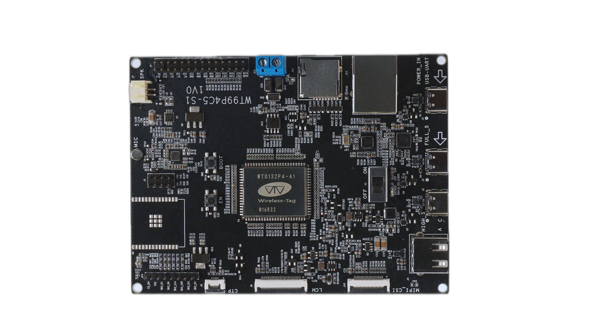

# WT99P4C5-S1 Development Board
WT99P4C5-S1 development board is a multimedia development board based on WT0132P4-A1 core board launched by Wireless-tag Technology Co., Limited

The WT0132P4-A1 core board based on Espressif ESP32-P4 series chip, featuring a dual-core 400 MHz RISC-V processor and 32 

MB PSRAM.Additionally, the ESP32-P4 supports various peripherals such as USB 2.0, MIPI-CSI and MIPI-DSI, making it ideal for

cost-effective, low-power multimedia product development.

